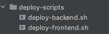

# Define UX

This is a platform where you can create the following UX diagrams for free:
Competitor Analysis, UX Personas, Empathy Maps.

They can be grouped by projects, saved on the server, and exported
to .jpg.

In the future, probably, it will be possible to create
User Flow, SiteMaps, CJM.

It is live and available at https://define-ux.com. (reload the page if the styles are not loaded)

## Running Locally

To run the frontend, navigate to its folder, install packages with
`npm install` and start with `npm run start`. This will start the frontend with
local parameters (different parameters will be used when deploying to the server).
The frontend will run on port 3000.

To run the backend, also navigate to its folder, install packages with
`npm install` and start with `npm run start:dev`. Local parameters will also be used here.
However, the database and S3 Bucket will be used from production. I was and still am
too lazy to make it possible to run these things locally. The backend will run on port 3001,
and Swagger can be viewed via the /docs route.

## AWS Deployment

The project has a folder with deployment scripts.

To deploy the frontend or backend, just run either of them.
Nothing else needs to be done, as mentioned above - both the database and bucket are already used
from production.

**BUT!!!** They are configured exclusively for my computer and may not work if
someone else runs them.

I didn't set up CI/CD, I'm too lazy.

More details about how these files are arranged will be below.

## Cloud Architecture

For details about the cloud infrastructure and deployment, see [CLOUD_ARCHITECTURE.md](docs/CLOUD_ARCHITECTURE.md).

## Solution Architecture

For details about the project structure and architecture, see [ARCHITECTURE.md](docs/ARCHITECTURE.md).

## Setting Up a Similar Project

For detailed instructions on how to configure a similar project from scratch, see [SETUP.md](docs/SETUP.md).
