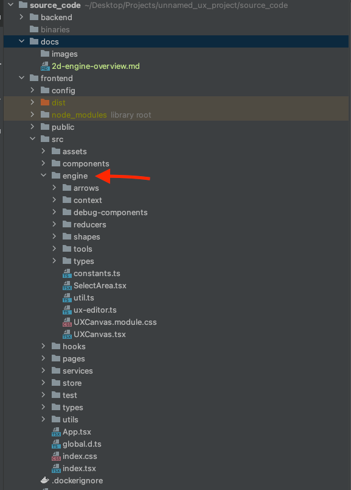
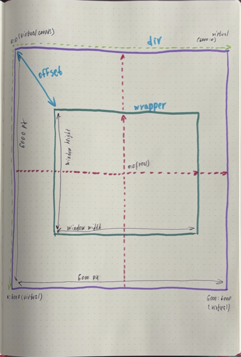
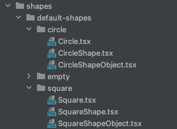
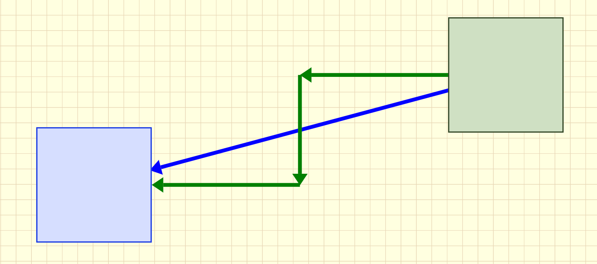
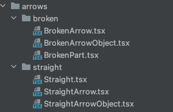
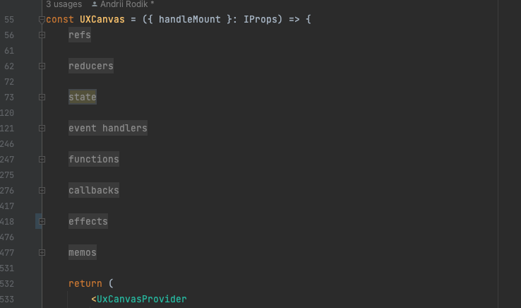

# 2D Graphics Engine (Diagrams)

* [Working Example](#working_sample)
* [General Logic](#general_logic)
* [Shapes](#shapes)
* [Arrows](#arrows)
* [More About Canvas](#more_canvas)
* [Miscellaneous](#misc)
* [Future Todo List](#todo)

The application uses its own custom diagram engine, similar to
tldraw.com, diagrams.js, draw.io or figma jam.

The decision to choose a custom engine didn't come out of nowhere. I analyzed
existing solutions and didn't find the tools I needed in them,
plus I looked at how difficult it would be to create my own from scratch
and decided to do exactly that.

But I was wrong ;) Very wrong. In fact, I gained, of course, incredible
frontend experience and more (some math after all). But the key
features for which I chose a custom engine are still not implemented,
and I spent this time reinventing the wheel. At least it rides.

If I could rewind time - I would most likely choose one
of the alternatives listed above, or buy some paid one, but
that's what experience is for, to be bitter, right?

Enough lyrics, let's move on to describing the engine's functionality.

### <a id="working_sample"></a> Working Example

1. Selecting shapes. To select multiple elements, hold `Shift`:
   
2. Resizing and moving shapes:
   
3. Text input by double-clicking on a shape:
   
4. Copying (holding alt/option) and deleting (backspace):
   
5. Drawing arrows: LMB - straight, RMB - broken:
   
6. Moving around the canvas with the middle mouse button pressed and scaling by scrolling the wheel (and using `+` and `-` buttons):
   

### <a id="general_logic"></a> General Logic

All the engine code is located in the frontend/engine folder:



The main file here is `UXCanvas.tsx`. It's actually
a component that embeds a canvas on the page, which you can move, create
shapes on, select them, delete them, draw arrows, and so on.

The following image shows schematically the logic of how the canvas
is positioned and moved:



There are two main blocks and two coordinate systems. The first block is the
so-called **div** (I used to call it infinite div) - this is a large
`<div>` element sized 6000x6000 (these dimensions are in /engine/constants,
variables `UX_CANVAS_DIV_DEFAULT_WIDTH` and `UX_CANVAS_DIV_DEFAULT_HEIGHT`).
The coordinate system used by this div is virtual. This is
the same coordinate system used in CSS, where there are no negative
coordinates and counting starts from the top left corner.

The second block is the so-called **wrapper**. This is the element that the
user sees. It can be any size, but I chose to make it
the size of the browser window (constants `UX_CANVAS_WRAPPER_WIDTH` and `HEIGHT`
respectively). It, in turn, uses the real (Cartesian) coordinate
system - with the center in the middle and the presence of negative coordinates.

All shapes and all logic use the real coordinate system,
but when it's necessary to save some element on the canvas, they are converted
to virtual coordinates. The /engine/util.ts file contains among other things
the logic for converting virtual coordinates to real ones and vice versa:

```typescript
export function toRealX(x: number): number {
    return x - UX_CANVAS_DIV_DEFAULT_OFFSET_X;
}
export function toRealY(y: number): number {
    return UX_CANVAS_DIV_DEFAULT_OFFSET_Y - y;
}
export function toVirtualX(x: number): number {
    return x + UX_CANVAS_DIV_DEFAULT_OFFSET_X;
}
export function toVirtualY(y: number): number {
    return UX_CANVAS_DIV_DEFAULT_OFFSET_Y - y;
}
```

The **wrapper** is always statically positioned in the same place,
while the **div** constantly changes its position relative to the **wrapper**.
So, essentially all the logic of "moving" the canvas is the logic of changing
the `left` and `top` CSS properties of the **div**. Yes, it's really that simple ;)

This property is called
**offset** and in the code it's implemented as a reducer (/engine/reducers/div-offset.reducer.ts).

> **Important note!** This is the only reducer for the entire engine, although there
> is indeed a need for more, I just didn't have enough
> time to implement them as well. So don't be surprised in the future
> when you see awkwardly inconvenient state logic for other data))

### <a id="shapes"></a> Shapes

The main building block of the engine is shapes. These are unique
objects that have an ID (uuid v4), width, height, coordinates, and text
that is displayed inside them. The main idea of shapes is the ability
to create your own shapes from any React components
absolutely without any problems. Let's figure out how this works.

To create your own shape, you'll need three files - the shape itself,
ShapeObject, and Shape (for example, there are already two default shapes implemented):



Let's take the implementation of a square as an example.

First, you need to create your own React component that will be used
as a shape. In our case - it's `Sqare.tsx`. This can be absolutely any
component, it has only two requirements: first, it should not accept
any props (although, this is not mandatory, but it will significantly break the)
logic, second, it must have CSS properties `width` and `height`
set to `100%`. Everything else doesn't matter - stuff whatever you want in there.

Next, you need to create a class for your component. It's called
ShapeObject and must inherit from `Shape.ts` (/engine/types/Shape.ts).
Our implementation looks like this:

```typescript jsx
export class SquareShapeObject extends Shape {
    constructor(properties: shapeProperties) {
        if (!properties.width) {
            properties.width = 300;
        }
        if (!properties.height) {
            properties.height = 300;
        }

        super(properties);
    }
    public component(): React.JSX.Element {
        return (
            <SquareShape
                id={this.id}
                key={this.id}
                coords={this.coords}
                width={this.width!}
                height={this.height!}
                text={this.text}
            />
        );
    }
}
```

As you can guess, its task is to set the default size of the shape
and specify which component corresponds to this shape.
But what component is this? We haven't looked at it yet. Here's its code:

```typescript jsx
const SquareShape = ({ id, coords, width, height, text }: IProps) => {
    return (
        <ShapeComponent
            id={id}
            coords={coords}
            width={width}
            height={height}
            text={text}>
            <Square />
        </ShapeComponent>
    );
};
```

Essentially, the task of **Shape** is to combine **ShapeObject** and your
component itself, and your component must be **mandatorily** wrapped
in `<ShapeComponent>`. This is the most important component related to
shapes. It contains their placement on the canvas, selection by clicking,
drawing arrows between shapes (`<ShapeArrowPoint.tsx>`), changing
sizes (`<ShapeBorder.tsx>` and `<ShapeSizePoints.tsx>`), and
text input (`<ShapeText.tsx>`).

> **Important note!** Dimensions, active/passive state, and text
> input state are passed to the shape from outside, from the UXCanvas context.
> Moreover, they are passed through the useEffect hook, not through props.
> Meanwhile, coordinates are passed to the shape through props :)
> Don't ask in the future why it's like this - there's no logic, I did what I knew, and only
> now I see that this could all be done in one way (either through
> useEffect or through props), but it is what it is, if you want to
> refactor in the future - go ahead.

### <a id="arrows"></a> Arrows

As in any diagramming program, you can draw arrows between
shapes here. There are two variations available - straight and broken (the so-called Manhattan
algorithm):



They are drawn from the center of one to the center of another, although previously the logic was developed
for the ability to draw them to four main points of the shape.

These two arrows are located in /engine/arrows:



Their logic is similar to the logic of shapes, i.e. there's also a wrapper class,
an intermediate component, and the arrow component itself, but since there are no plans
for the ability to create custom types of arrows, everything is much simpler
in terms of logic here.


The straight arrow determines the distance between the centers of two shapes
using the Pythagorean formula:

```typescript
export function getDistanceBetweenTwoPoints(
    coordsStart: Point,
    coordsFinish: Point
): number {
    return Math.sqrt(
        Math.pow(coordsFinish.x - coordsStart.x, 2) +
        Math.pow(coordsFinish.y - coordsStart.y, 2)
    );
}
```

and the angle between these centers using the arctangent relation between them:

```typescript
export function getAngleBetweenTwoPoints(
    coordsStart: Point,
    coordsFinish: Point
): number {
    const angleInRadians = Math.atan2(
        coordsStart.y - coordsFinish.y,
        coordsFinish.x - coordsStart.x
    );

    return convertRadiansToDegrees(angleInRadians);
}
export function convertRadiansToDegrees(rad: number): number {
    return rad * (180 / Math.PI);
}
```

The broken line, in turn, uses a ready-made algorithm from
the diagram.js library, since implementing it myself would have taken too
long.

> **Important note!** The broken line is implemented rather poorly, in the sense that
> logic for working with bends needs to be added, because for now it's just
> a set of regular straight lines at different angles


### <a id="more_canvas"></a> More About Canvas

As mentioned earlier, the main file is the canvas `UXCanvas.tsx`.
It accepts a single argument as a prop - the callback `handleMount`, which
in turn accepts an object of type `UXEditor` as an argument. This is a class
that contains the API for working with the canvas. This is the whole point
of this entire "engine". We provide the ability to programmatically control
the canvas logic (add, delete shapes, etc.), not just
through the canvas itself. This file is quite simple to understand, so
I won't focus too much on it.

The `UXCanvas.tsx` component itself is divided into logical blocks:



From the names, everything should be clear, plus there are comments in the code
for many potentially confusing things.

All the necessary state is located directly in the component. At the same time, as
mentioned earlier, there's only one reducer here, although there really is
a need for more.

A lot of code for working with state has been moved to the /engine/tools/ folder
to avoid cluttering UXCanvas.

The component is wrapped in `UxCanvasProvider` - a collection of contexts for
working with `UXCanvas`. They are all located in the /engine/context/ folder,
from the name of each of them it's clear what they're needed for.

### <a id="misc"></a> Miscellaneous

##### Debug Components
The /engine/debug-components/ folder contains components that are used
during development, if you don't need them - comment them out in UXCanvas.

`<AbsoluteCenter>` - shows the center of the screen, it was needed
to properly implement scaling through the `+` and `-` keys.

`<CanvasStateDebugInfo>` - shows the following data in the lower right corner
of the state from UXCanvas: `scale`, `selecting`, `moving`, `dragging`.

`<CoordsDebugInfo>` - shows coordinate data in the lower left corner:
real and virtual mouse coordinates, offset, coordinates relative to the wrapper and
relative to the browser window (ClientX, ClientY).

`<GriddedCoordsSystem>` - draws a background with squares and lines along the
X and Y axes. Also this is the most laggy component) If needed - I think
it can be optimized.

`<MathFunctionSamples>` - simply shows how the coordinate system works,
drawing graphs of well-known functions on the canvas: linear, constant, logN,
NlogN, quadratic.

##### Select Area

This is a component that draws a rectangular blue area
on top of the canvas, and sets the `isSelected` property
to `true` for all shapes that fall within it.

### <a id="todo"></a> Future Todo List

* Copy, cut, and paste with keyboard shortcuts (there's already a ready
file for this in /engine/tools/copy-paste-cut.tool.ts).
* Adapt all functionality for mobile phones.
* Add functions to `UXEditor`, not sure which ones yet.
* Finish implementing the broken line.
