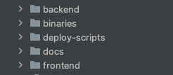
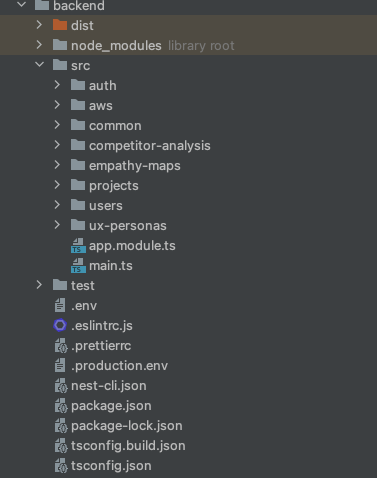
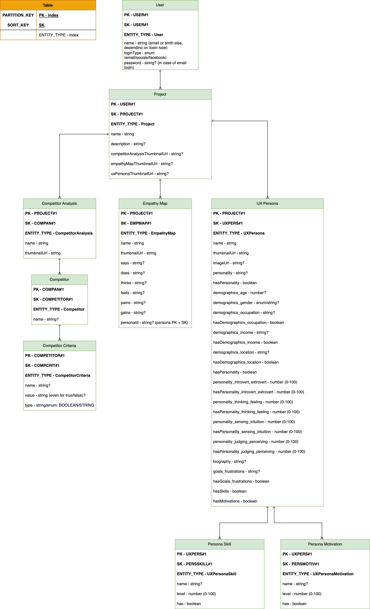
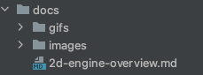
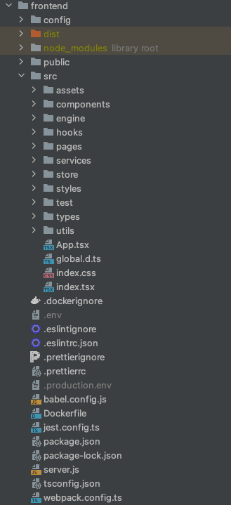

# Solution Architecture

The project has the following structure:

It's a monolith: one backend on Node.js and one frontend on React. Brief overview of the folders.

**backend**

A typical Nest.js project. The architecture is standard NestJS, which in my opinion
is very cool and clear. What I changed - settings for prettier, eslint,
tsconfig. From the name of each module it should be clear what it's responsible for, the backend
is really small.

Authorization is written manually, without using third-party services. Swagger is used for
API documentation.

Database ER diagram: **(The schema was slightly modified during development)**

It's simple here: an entity for each module, together with dependent sub-entities, plus
a project to combine dependent diagrams (modules/components) and a user. That's it.

**deploy-scripts**

I wrote about this folder earlier, and I'll tell about its contents in the next section.

**docs**

This contains .md documentation files and images for them.

**frontend**

A React project using webpack and babel. Also configured eslint, prettier,
jest (which wasn't used), typescript, docker (also wasn't used) to my preferences.
Styles are done manually - custom grid, custom UI Kit, basically all styles written from scratch.

For server requests, regular fetch is used.

For global state, Redux Toolkit is used.

Export works by simply scanning the user's screen :) using html2canvas.

Also, I spent 2 months creating my own 2D engine for diagrams and never
put it into production. I decided not to delete it from production, so you can
view it at the /testsitemap route (doesn't work on mobile). [Engine
documentation.](2D-ENGINE-OVERVIEW.md)
