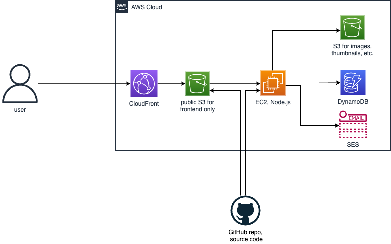

# Cloud Architecture

## AWS Part

The project uses mainly AWS infrastructure: the backend is deployed on EC2, which
is configured manually, without Docker or anything similar. (How to configure a similar
project will be described below). Node.js is run through PM2 so the process can work
in the background. Nest.js is used as the framework.

The database is DynamoDB, chosen because
it's cheap (serverless), although I don't really like it and would prefer
a relational database if there was money.

Images uploaded by users are stored in an S3 bucket, and export images
from the frontend are also stored there if they are used as thumbnails.

For sending emails I chose AWS SES. It's cheap and faster than setting up your own
SMTP server.

The frontend is written in React using Webpack and Babel. It's deployed in
an S3 bucket, which is accessed through CloudFront. This is needed to connect an SSL certificate,
since it's not possible directly to the bucket (probably). Plus it's fast and cheap.

## Non-AWS Part

The domain is registered on Godaddy. It's bad. You can't configure a CNAME to the root
to point to a domain name, only to another IP address. And CloudFront only provides
a domain name. So Godaddy is useless, and I use CloudFlare for DNS. Although
the domain registration is still (for now) with Godaddy.

It's also important to note that I use business email support@define-ux.com, which
also costs money. I use Namecheap for this, as it's cheaper than
others.
