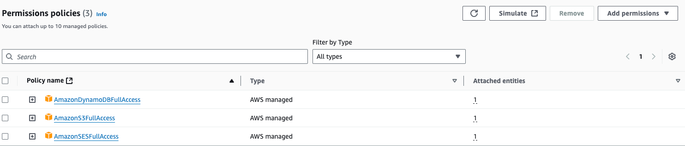
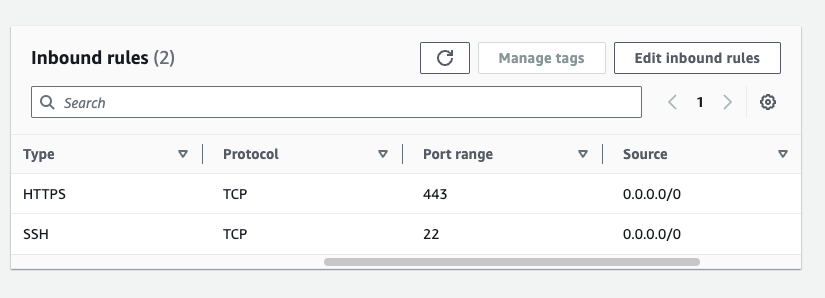
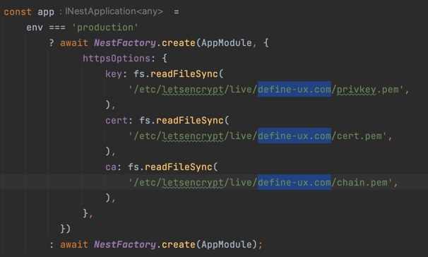
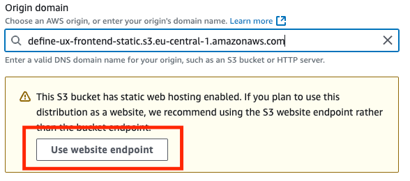

# Setting Up a Similar Project

**EC2**

I used Amazon Linux, which I connected to via ssh and simply
sent files there from my computer, installed dependencies there and ran
the application.

Here are the steps you need to do:

1. Create an Amazon Linux EC2 instance.
2. Create a role for the instance and add the following policies (possibly not the ideal
choice):

3. Create a security group with the following rules:

4. Create and attach an Elastic IP address to the instance.
5. Make sure you have SSH keys for connection, if not - create them.
6. Connect to the instance with the command `ssh ec2-user@228.1337.0000.322 -i ../DefineUXKeyPair.pem`, with
the IP address replaced with your instance's address and the path to the SSH key.
7. Install Node.js `dnf install nodejs` (haven't checked if it works)
8. Install PM2 `sudo npm install pm2@latest -g`
9. Create an app folder where the application will run: `mkdir app`
10. Install certbot to get a free SSL certificate
`sudo yum install certbot `
11. Create a certificate `sudo certbot certonly --manual --preferred-challenges
dns -d '*.yourdomain.com' -d 'yourdomain.com'`. Here it should be emphasized that
this command creates a certificate for subdomains as well, since in our case
we use the subdomain api.define-ux.com.
12. Install crontab for automatic SSL certificate renewal
`sudo yum install cronie`. And then `sudo systemctl enable crond &&
    sudo systemctl start crond`
13. Enter crontab `sudo crontab -e` and insert the following line there
`0 0 * * * /usr/bin/certbot renew --quiet`
14. In the `main.ts` file on the backend, replace the domain name with the new one


**Hosting Static Files on S3**

1. You need to create a **separate** S3 bucket for static files. You cannot use
a bucket that is used by another part of the application. When creating, you need to
uncheck block all public access.
2. On the properties tab at the very bottom, you need to enable Static website hosting.
For both the main file and error file, specify index.html.
3. On the permissions tab, add the following bucket policy:
```json
{
   "Version": "2012-10-17",
   "Statement": [
       {
       "Sid": "PublicReadGetObject",
       "Effect": "Allow",
       "Principal": "*",
       "Action": "s3:GetObject",
       "Resource": "arn:aws:s3:::define-ux-frontend-static/*" // change the name to your bucket here
       }
   ]
}
```
4. Create a CloudFront Distribution. Specify as origin name the DNS name that
the S3 bucket gave us and click on the next button:

5. Select below in Viewer protocol policy the option `HTTPS only` (optional) and methods
`GET, HEAD, OPTIONS, PUT, POST, PATCH, DELETE` (also optional).
6. In Web Application Firewall (WAF) select `Do not enable security protections`.
7. For Price class select `Use only North America and Europe`, as it's the cheapest.
8. Then don't change anything and click `Create distribution`.
9. Add in settings `Alternate domain name (CNAME)` our domain.
10. Go to AWS Certificate Manager in the `us-east-1` region and request a public SSL certificate. As
the domain address, specify the domain address of the site you bought. All other parameters
are default.

**Domains**
1. You need to buy a domain if you haven't already. Don't buy from Godaddy because
it doesn't support CNAME to root with domain names. I bought mine on Cloudflare.
2. You need to configure many DNS records, but for the application to work you only need
two. First, let's configure the first one - type `A`, name `api` content `1337.0000.228.322`,
that is, the backend IP address.
3. The second - type `CNAME`, name `@` (i.e. root), content - CloudFront's DNS address.

Other DNS records are related to domain email, SEO, etc. They are not required for operation.

**Deployment Scripts**

The code for backend deployment is as follows:
```shell
#!/bin/bash

USER="ec2-user"
HOST="228.0000.322.1337"
SOURCE_CODE_DIR="<PATH TO PROJECT CODE>"

cd "$SOURCE_CODE_DIR"

pwd
zip -r ./backend.zip ./backend -x -x "*/node_modules/*" "*/dist/*"
scp -i ../DefineUXKeyPair.pem -r ./backend.zip "$USER@$HOST":/home/ec2-user
rm ./backend.zip

ssh "$USER@$HOST" -i ../DefineUXKeyPair.pem << EOF
  sudo pm2 kill
  cd app
  sudo rm -rf ./*
  cd ..
  mv backend.zip app/
  cd app
  unzip backend.zip
  cd backend/
  sudo npm install
  sudo npm run build
  sudo NODE_ENV=production pm2 start ./dist/main.js
EOF
```

You need to replace the variables with your own: `HOST` - this is the EC2 instance address.
`SOURCE_CODE_DIR` - this is the absolute path to the project code directory.
`../DefineUXKeyPair.pem` - this is the path to the SSH key file from the EC2 instance.

In short, what this file does is:
1. Creates a .zip archive with the code.
2. Sends it to the EC2 instance via the `scp` command.
3. Connects to the instance via ssh.
4. Stops the running application and deletes the old code.
5. Unzips the new code that was previously sent with the `scp` command.
6. Installs packages.
7. Starts the new version of the application via PM2 with `NODE_ENV` set to `production`.

Frontend deployment is simpler:

```shell
#!/bin/bash

SOURCE_CODE_DIR="<PATH TO PROJECT CODE>"

cd "$SOURCE_CODE_DIR"

cd ./frontend
npm run build -- --env analyzeBundle=false
aws s3 sync ./dist s3://define-ux-frontend-static --delete
aws cloudfront create-invalidation --distribution-id ************* --paths "/*"
```

It works the opposite way: first it builds the project on my computer locally and then
sends it to the server. First, with the `aws s3 sync` command, it synchronizes local
files with files on the server, deleting from the server those files that weren't there locally.
With the next command `aws cloudfront create-invalidation` we revalidate the cloudfront
distribution. Instead of `*************` you need to insert your distribution's name.
